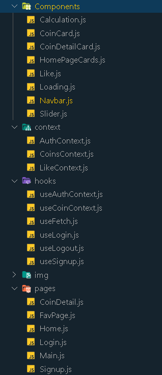

# CryptoView

## 1.Api  Links 

[Coingecko.com](https://www.coingecko.com/en/api/documentation)
[coinstats.app](https://documenter.getpostman.com/view/5734027/RzZ6Hzr3)

## 2. Description

The CryptoView uses [The Coingecko API](https://www.coingecko.com/en/api) 
Brings coins  and calculate user input and also let user  add coins to watchlist.
Please run  " npm run dev " on backend folder and then "npm run start" on fronted folder.

 
## 3. Structure Tree

## 5. Must Haves

- Application must have  watchlist page for each user.
- User is able to add coins his/her    watchlist.
- User is able to remove coins his/her   watchlist.
- User is able to coin details by clicking on the image of coin .

## 6. Nice-to Have

- User is able to follow recent news main page 
- User should be able to sign up with email/username and password .
- Password must be strong. 
- User should be able to sign in with the email/username and password.

# CryptoView
